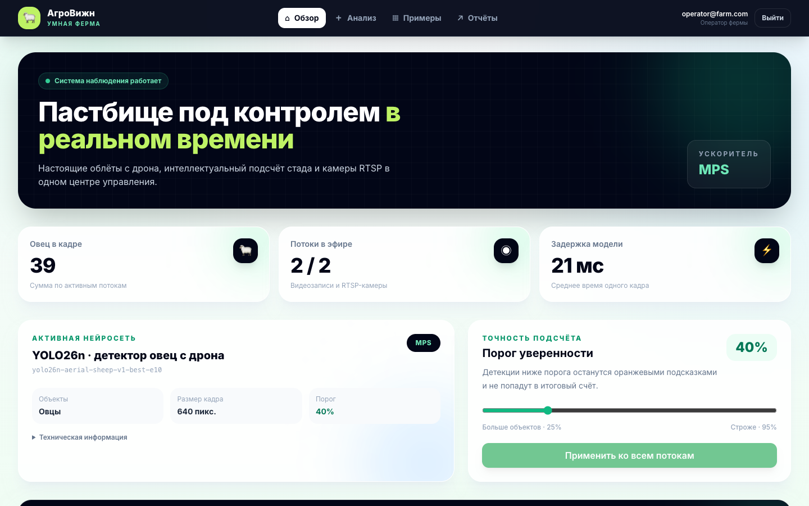
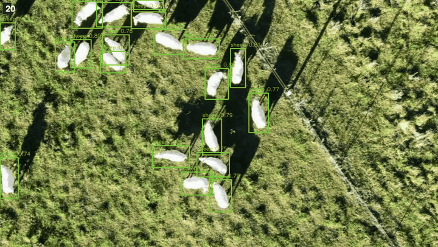
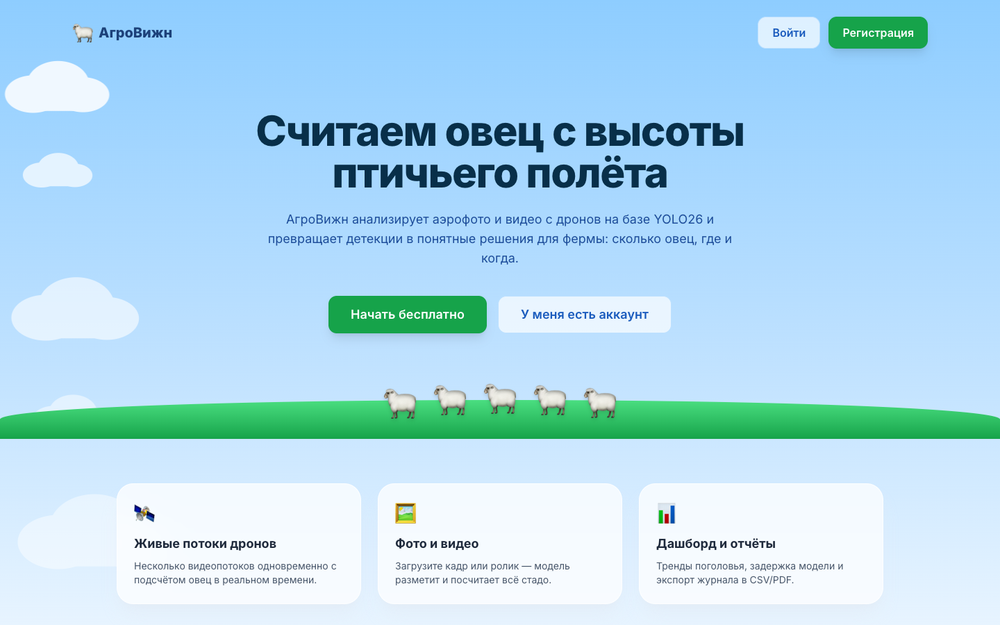
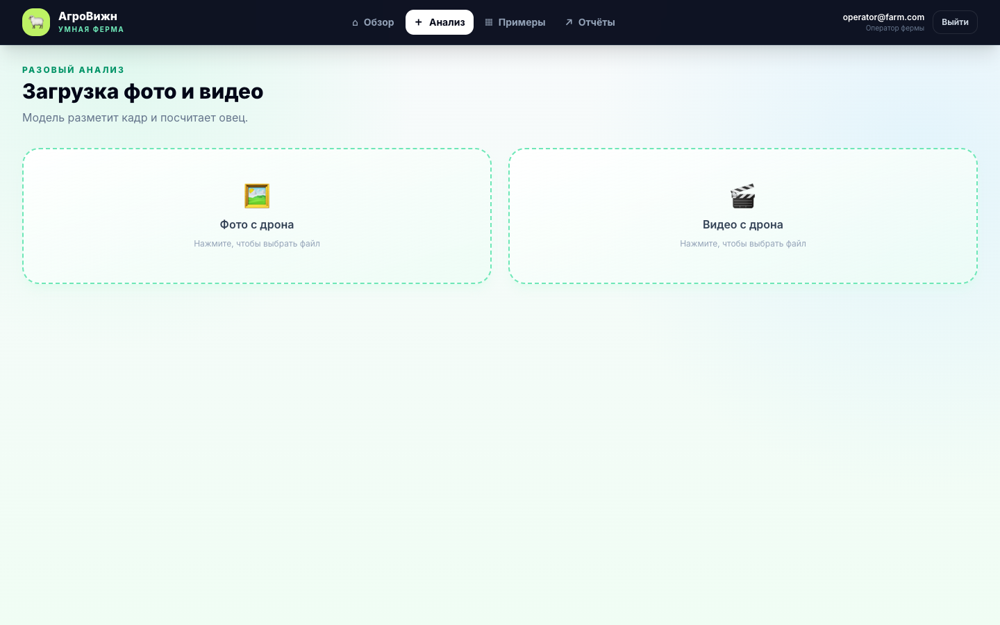
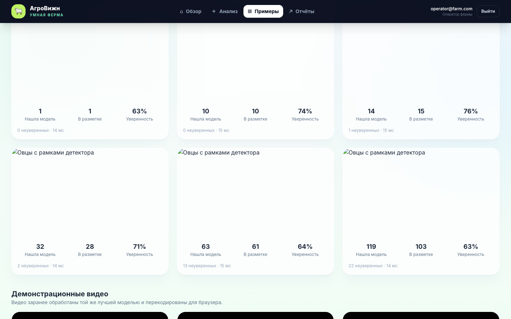
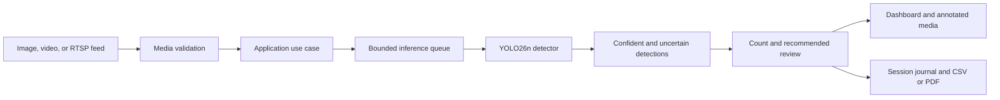

<div align="center">

# AgroVision

### Aerial sheep detection, counting, and operational monitoring

[](https://github.com/HoshiBatista/hackaton_apk/actions/workflows/ci.yml)


**English** | [Русская версия](README_RUS.md)

A locally controlled computer-vision product that turns drone images, uploaded
videos, and live camera feeds into a sheep count, confidence-aware findings, and
an exportable operational record.

</div>



## What problem it solves

Counting a dispersed flock from aerial footage is slow, repetitive, and difficult
to audit. AgroVision gives a livestock operator one workflow for answering a
practical question: how many sheep are visible, how certain is the model, and
which feed needs human attention?

The product goes beyond drawing boxes. It validates media, runs a versioned local
model, separates confident and uncertain detections, aggregates live streams,
records authenticated sessions, and exports CSV or PDF reports.

This repository is a measured hackathon MVP, not a certified livestock accounting
system. Its known model and dataset limitations are documented below.

## Inference demo

The preview below is a real annotated output produced by
`yolo26n-aerial-sheep-v1-best-e10`. Green boxes are detections above the operating
threshold; amber boxes are visible but uncertain predictions.



[Open the 7.5-second H.264 inference video](docs/media/agrovision-inference-demo.mp4)

## Product screens

<table>
  <tr>
    <td width="33%"></td>
    <td width="33%"></td>
    <td width="33%"></td>
  </tr>
  <tr>
    <td align="center">Product entry point</td>
    <td align="center">Image and video analysis</td>
    <td align="center">Model output examples</td>
  </tr>
</table>

## Core capabilities

- Image inference with an annotated result, sheep count, confidence values, model
  version, and processing time.
- Video inference with an annotated MP4, per-frame time series, peak count, and
  representative key frames.
- Concurrent file-backed drone feeds and dynamically connected RTSP cameras.
- Live aggregate dashboard over WebSocket with per-source counts and latency.
- Runtime confidence-threshold control shared by every inference entry point.
- JWT registration, login, refresh, roles, and authenticated session history.
- CSV and PDF exports for operational reporting.
- Versioned FastAPI contract with stable errors and request correlation IDs.
- Fully local happy path after dependencies, weights, and data are prepared.

## How it works



The model is loaded once during application startup. Blocking PyTorch work runs
outside the asyncio event loop, and all inference consumers share one bounded
queue so a single detector instance is never used concurrently without control.

## Measured baseline

The selected checkpoint was trained at 640 px on Roboflow
`riis/aerial-sheep`, version 1, with one class: `sheep`.

| Metric | Result |
|---|---:|
| Precision | 95.82% |
| Recall | 93.41% |
| mAP@50 | 96.27% |
| mAP@50–95 | 56.80% |
| Count MAE | 6.28 sheep |
| Count RMSE | 11.39 sheep |
| CPU inference latency p50 | 31.9 ms |
| CPU inference latency p95 | 35.5 ms |

These numbers come from the recorded test run in
[`configs/model_yolo26n_aerial_sheep_v1.toml`](configs/model_yolo26n_aerial_sheep_v1.toml).
The downloaded dataset contains adjacent DJI video frames across train,
validation, and test splits. The metrics are therefore optimistic until the split
is rebuilt by source video or flight. See
[`ADR 0001`](docs/adr/0001-aerial-sheep-baseline.md).

## Architecture

AgroVision is a modular monolith with inward-facing dependencies.

```text
apps/
  api/                 FastAPI composition, routes, upload validation
  web/                 React, TypeScript, Vite, Tailwind
src/agrovision/
  domain/              Entities and domain rules; no frameworks
  application/         Use cases, DTOs, and Protocol ports
  infrastructure/      YOLO, OpenCV, SQLAlchemy, auth, storage, streams
  presentation/        API schemas and presenters
ml/
  data/                Dataset validation and preparation
  training/            Reproducible YOLO training entry point
  evaluation/          Detection, counting, and latency reports
configs/               Versioned application and model configuration
tests/                 Unit, contract, and PostgreSQL integration tests
```

FastAPI routes remain thin. Domain code does not import FastAPI, SQLAlchemy,
Ultralytics, or OpenCV. Database, detector, storage, and stream implementations
are connected through application ports.

## Technology

| Area | Tools |
|---|---|
| Model and media | PyTorch, Ultralytics YOLO, OpenCV, Pillow |
| API | FastAPI, Pydantic v2, Uvicorn |
| Web | React 18, TypeScript, Vite, Tailwind, Recharts |
| Data | SQLAlchemy async, SQLite, PostgreSQL, Alembic |
| Security | Argon2, JWT, validated environment settings |
| Quality | pytest, Ruff, mypy, GitHub Actions |
| Packaging | uv, npm lockfile, Docker Compose |

## Quick start

### Requirements

- Python 3.12
- [`uv`](https://docs.astral.sh/uv/)
- Node.js 22 and npm
- FFmpeg for browser-compatible generated videos
- The selected `best.pt` checkpoint, or the dataset and compute needed to train it

### 1. Install dependencies and create local configuration

```bash
git clone git@github.com:HoshiBatista/hackaton_apk.git
cd hackaton_apk

make setup
make web-setup
make configure
```

`make configure` creates or safely updates the ignored `.env`, generates local
secrets without printing them, selects SQLite, and preserves existing values.

### 2. Provide the model artifact

Weights are intentionally excluded from Git. Put the selected checkpoint at:

```text
artifacts/training/yolo26n-aerial-sheep-v1/weights/best.pt
```

Verify it before starting the application:

```bash
make model-checksum
```

Expected SHA-256:

```text
29561fa0c96052b9efac892a1dd4a6418508992f4c882b661d08afe5ba124e0d
```

The API fails fast if the checkpoint is missing or its checksum does not match.

### 3. Initialize and run

```bash
make migrate
make seed
make local
```

Open `http://localhost:5173`. The local API listens on
`http://localhost:8000`, with interactive documentation at
`http://localhost:8000/docs` in development mode.

The seeded local demo account is:

```text
Email: operator@farm.com
Password: sheep12345
```

Use this account only for local demonstration.

## Dataset, training, and evaluation

The raw dataset is not committed. Export Roboflow `riis/aerial-sheep` version 1
in YOLO format and place it at:

```text
data/raw/aerial-sheep-1/
  data.yaml
  train/
  valid/
  test/
```

Then run the reproducible pipeline:

```bash
make prepare
make train
make evaluate
```

`make prepare` keeps the raw export immutable, creates a processed YOLO view,
and removes invalid zero-area annotations. Training settings, seed, device
selection, and output paths live in
[`configs/train_yolo26n_aerial_sheep.toml`](configs/train_yolo26n_aerial_sheep.toml).

To generate the offline examples and annotated videos used by the UI:

```bash
make demo-data
make demo-predictions
```

## API

| Method | Path | Purpose |
|---|---|---|
| `GET` | `/health` | Process health |
| `GET` | `/ready` | Model readiness |
| `GET` | `/v1/model-info` | Version, checksum, thresholds, limitations |
| `POST` | `/v1/predictions` | Validated image inference |
| `POST` | `/v1/predictions/video` | Validated video inference |
| `PATCH` | `/v1/model-threshold` | Change the shared operating threshold |
| `POST` | `/v1/auth/register` | Register a user |
| `POST` | `/v1/auth/login` | Obtain access and refresh tokens |
| `GET` | `/v1/dashboard` | Current aggregate stream state |
| `WS` | `/v1/dashboard/ws` | Live dashboard updates |
| `GET`, `POST`, `DELETE` | `/v1/streams` | Manage file and RTSP streams |
| `GET` | `/v1/reports/sessions` | Authenticated session journal |
| `GET` | `/v1/reports/export.csv` | CSV report |
| `GET` | `/v1/reports/export.pdf` | PDF report |

Uploads are checked by decoded content rather than filename extension and are
limited by media type, bytes, pixel count, and processing constraints. API errors
use stable response bodies and every HTTP request receives an `X-Request-ID`.

## Docker

After configuring `.env` and placing the model artifact, start the full stack:

```bash
make docker-up
```

The Docker profile runs the web application at `http://localhost:8080`, FastAPI
at `http://localhost:8000`, and PostgreSQL on loopback only. The API container
runs as a non-root user, model and demo inputs are mounted read-only, and mutable
data is stored in named volumes.

## Development and CI

```bash
make lint
make typecheck
make test

cd apps/web
npm run lint
npm run build
```

GitHub Actions repeats these checks from locked dependencies. Its Python job uses
a real PostgreSQL 16 service, so repository and authenticated end-to-end tests do
not silently skip in CI. The web job performs a clean npm installation, TypeScript
check, and production build. Workflow permissions are read-only and concurrent
runs on the same branch are cancelled.

## Security model

- `.env`, datasets, weights, uploads, and generated predictions are ignored.
- Production-like environments reject the public placeholder JWT secret.
- Passwords use Argon2; access and refresh tokens have separate lifetimes.
- RTSP credentials remain server-side and are not returned in stream listings.
- The selected checkpoint is validated by SHA-256 before inference.
- Raw images, tokens, and personal metadata are not logged by default.

## Known limitations

- Counts are visual estimates. Occlusion, flock density, altitude, motion blur,
  shadows, and small objects can cause misses or duplicate detections.
- Dataset split leakage makes the published baseline metrics optimistic.
- The operating threshold must be chosen from validation behavior and field cost;
  it must not be tuned on the held-out test set.
- The current product uses one detector. A second model requires a measured
  workflow benefit and a new architecture decision record.
- The application has not yet been validated as a production livestock system.

## Project documentation

- [Product scope and architecture decision](docs/adr/0002-product-scope.md)
- [Dataset and baseline decision](docs/adr/0001-aerial-sheep-baseline.md)
- [Runtime and container decision](docs/adr/0003-model-runtime-and-containers.md)
- [Pitch deck](docs/presentation/AgroVision_pitch_deck.pdf)
- [Speaker notes](docs/presentation/speaker_notes.md)
