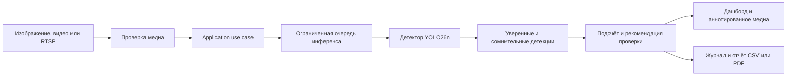

<div align="center">

# АгроВижн

### Детекция, подсчёт и операционный мониторинг овец с воздуха

[](https://github.com/HoshiBatista/hackaton_apk/actions/workflows/ci.yml)


[English version](README.md) | **Русская версия**

Локально управляемый CV-продукт, который превращает снимки с дрона,
загруженные видео и потоки с камер в подсчёт овец, результаты с учётом
уверенности модели и экспортируемый операционный отчёт.

</div>


## Какую задачу решает продукт

Ручной подсчёт распределённого стада по аэросъёмке занимает много времени,
повторяется после каждого облёта и плохо поддаётся проверке. АгроВижн объединяет
работу оператора в один сценарий: сколько овец видно, насколько уверена модель и
какой источник требует внимания человека.

Продукт не ограничивается рамками на изображении. Он проверяет входные файлы,
запускает версионированную локальную модель, разделяет уверенные и сомнительные
детекции, агрегирует видеопотоки, сохраняет авторизованные сессии и формирует
отчёты CSV или PDF.

Это измеренный MVP для хакатона, а не сертифицированная система учёта поголовья.
Известные ограничения модели и датасета честно описаны ниже.

## Демонстрация инференса

Ниже показан реальный аннотированный результат модели
`yolo26n-aerial-sheep-v1-best-e10`. Зелёные рамки соответствуют детекциям выше
рабочего порога, янтарные рамки обозначают видимые, но сомнительные предсказания.


[Открыть 7,5-секундное видео инференса H.264](docs/media/agrovision-inference-demo.mp4)

## Экраны продукта

<table>
  <tr>
    <td width="33%"></td>
    <td width="33%"></td>
    <td width="33%"></td>
  </tr>
  <tr>
    <td align="center">Вход в продукт</td>
    <td align="center">Анализ изображений и видео</td>
    <td align="center">Примеры вывода модели</td>
  </tr>
</table>

## Основные возможности

- Инференс изображения с аннотированным результатом, количеством овец,
  уверенностью, версией модели и временем обработки.
- Инференс видео с аннотированным MP4, временным рядом, пиковым количеством и
  ключевыми кадрами.
- Одновременные файловые потоки с дронов и динамически подключаемые RTSP-камеры.
- Сводный дашборд по WebSocket с количеством и задержкой каждого источника.
- Единое управление порогом уверенности для всех точек инференса.
- Регистрация, вход, refresh-токены, роли и журнал авторизованных сессий.
- Экспорт CSV и PDF для операционной отчётности.
- Версионированный FastAPI-контракт со стабильными ошибками и request ID.
- Полностью локальный happy path после подготовки зависимостей, весов и данных.

## Как это работает



Модель загружается один раз при старте приложения. Блокирующая работа PyTorch
выполняется вне asyncio event loop, а все потребители инференса используют одну
ограниченную очередь. Один экземпляр детектора не используется параллельно без
контроля.

## Измеренный baseline

Выбранный checkpoint обучен с размером изображения 640 px на Roboflow
`riis/aerial-sheep`, версия 1. Единственный класс модели — `sheep`.

| Метрика | Результат |
|---|---:|
| Precision | 95,82% |
| Recall | 93,41% |
| mAP@50 | 96,27% |
| mAP@50–95 | 56,80% |
| MAE подсчёта | 6,28 головы |
| RMSE подсчёта | 11,39 головы |
| CPU latency p50 | 31,9 мс |
| CPU latency p95 | 35,5 мс |

Значения взяты из зафиксированного тестового запуска в
[`configs/model_yolo26n_aerial_sheep_v1.toml`](configs/model_yolo26n_aerial_sheep_v1.toml).
В исходном датасете соседние кадры DJI-видео пересекают train, validation и test.
Поэтому метрики оптимистичны до пересборки split по исходным видео или полётам.
Подробности записаны в [`ADR 0001`](docs/adr/0001-aerial-sheep-baseline.md).

## Архитектура

АгроВижн реализован как модульный монолит с зависимостями, направленными внутрь.

```text
apps/
  api/                 Композиция FastAPI, маршруты, проверка загрузок
  web/                 React, TypeScript, Vite, Tailwind
src/agrovision/
  domain/              Сущности и правила без фреймворков
  application/         Use cases, DTO и Protocol-порты
  infrastructure/      YOLO, OpenCV, SQLAlchemy, auth, storage, streams
  presentation/        API-схемы и presenters
ml/
  data/                Проверка и подготовка датасета
  training/            Воспроизводимая точка входа обучения YOLO
  evaluation/          Метрики детекции, подсчёта и задержки
configs/               Версионированные настройки приложения и модели
tests/                 Unit, contract и PostgreSQL integration tests
```

Маршруты FastAPI остаются тонкими. Домен не импортирует FastAPI, SQLAlchemy,
Ultralytics или OpenCV. Реализации базы данных, детектора, хранилища и потоков
подключаются через порты application-слоя.

## Технологии

| Область | Инструменты |
|---|---|
| Модель и медиа | PyTorch, Ultralytics YOLO, OpenCV, Pillow |
| API | FastAPI, Pydantic v2, Uvicorn |
| Web | React 18, TypeScript, Vite, Tailwind, Recharts |
| Данные | SQLAlchemy async, SQLite, PostgreSQL, Alembic |
| Безопасность | Argon2, JWT, валидируемые настройки окружения |
| Качество | pytest, Ruff, mypy, GitHub Actions |
| Сборка | uv, npm lockfile, Docker Compose |

## Быстрый старт

### Требования

- Python 3.12
- [`uv`](https://docs.astral.sh/uv/)
- Node.js 22 и npm
- FFmpeg для генерации совместимых с браузером видео
- Выбранный checkpoint `best.pt` либо датасет и вычислительные ресурсы для обучения

### 1. Установить зависимости и создать локальную конфигурацию

```bash
git clone git@github.com:HoshiBatista/hackaton_apk.git
cd hackaton_apk

make setup
make web-setup
make configure
```

`make configure` создаёт или безопасно обновляет игнорируемый `.env`, генерирует
локальные секреты без их вывода, выбирает SQLite и сохраняет существующие значения.

### 2. Добавить артефакт модели

Веса намеренно исключены из Git. Поместите выбранный checkpoint по пути:

```text
artifacts/training/yolo26n-aerial-sheep-v1/weights/best.pt
```

Проверьте его перед запуском:

```bash
make model-checksum
```

Ожидаемый SHA-256:

```text
29561fa0c96052b9efac892a1dd4a6418508992f4c882b661d08afe5ba124e0d
```

API завершит запуск с понятной ошибкой, если checkpoint отсутствует или его
контрольная сумма не совпадает.

### 3. Инициализировать и запустить

```bash
make migrate
make seed
make local
```

Откройте `http://localhost:5173`. Локальный API доступен на
`http://localhost:8000`, интерактивная документация в development-режиме — на
`http://localhost:8000/docs`.

Локальный демонстрационный аккаунт:

```text
Email: operator@farm.com
Password: sheep12345
```

Используйте его только для локальной демонстрации.

## Датасет, обучение и оценка

Raw-датасет не хранится в Git. Экспортируйте Roboflow
`riis/aerial-sheep` версии 1 в формате YOLO и разместите его по структуре:

```text
data/raw/aerial-sheep-1/
  data.yaml
  train/
  valid/
  test/
```

Запустите воспроизводимый конвейер:

```bash
make prepare
make train
make evaluate
```

`make prepare` сохраняет исходный экспорт неизменным, создаёт обработанное YOLO-
представление и удаляет невалидные рамки нулевой площади. Параметры обучения,
seed, выбор устройства и выходные пути находятся в
[`configs/train_yolo26n_aerial_sheep.toml`](configs/train_yolo26n_aerial_sheep.toml).

Для создания офлайн-примеров и аннотированных видео интерфейса выполните:

```bash
make demo-data
make demo-predictions
```

## API

| Метод | Путь | Назначение |
|---|---|---|
| `GET` | `/health` | Состояние процесса |
| `GET` | `/ready` | Готовность модели |
| `GET` | `/v1/model-info` | Версия, SHA-256, пороги и ограничения |
| `POST` | `/v1/predictions` | Проверенный инференс изображения |
| `POST` | `/v1/predictions/video` | Проверенный инференс видео |
| `PATCH` | `/v1/model-threshold` | Изменение общего рабочего порога |
| `POST` | `/v1/auth/register` | Регистрация пользователя |
| `POST` | `/v1/auth/login` | Получение access и refresh tokens |
| `GET` | `/v1/dashboard` | Текущее состояние потоков |
| `WS` | `/v1/dashboard/ws` | Обновления дашборда в реальном времени |
| `GET`, `POST`, `DELETE` | `/v1/streams` | Управление файловыми и RTSP-потоками |
| `GET` | `/v1/reports/sessions` | Журнал авторизованных сессий |
| `GET` | `/v1/reports/export.csv` | Отчёт CSV |
| `GET` | `/v1/reports/export.pdf` | Отчёт PDF |

Загрузки проверяются по декодированному содержимому, а не по расширению файла.
Ограничиваются media type, размер, число пикселей и параметры обработки. API
возвращает стабильные тела ошибок и добавляет `X-Request-ID` к каждому HTTP-запросу.

## Docker

После настройки `.env` и размещения артефакта модели запустите полный стек:

```bash
make docker-up
```

Docker-профиль запускает web на `http://localhost:8080`, FastAPI на
`http://localhost:8000`, а PostgreSQL публикует порт только на loopback. API-
контейнер работает не от root, модель и демонстрационные файлы подключаются
read-only, изменяемые данные сохраняются в именованных volumes.

## Разработка и CI

```bash
make lint
make typecheck
make test

cd apps/web
npm run lint
npm run build
```

GitHub Actions повторяет эти проверки из lock-файлов. Python job использует
реальный сервис PostgreSQL 16, поэтому тесты репозиториев и авторизованного end-to-
end сценария не пропускаются в CI. Web job выполняет чистый `npm ci`, проверку
TypeScript и production-сборку. Workflow имеет только read-доступ, а устаревшие
запуски одной ветки автоматически отменяются.

## Модель безопасности

- `.env`, датасеты, веса, загрузки и сгенерированные предсказания игнорируются.
- Окружения, близкие к production, отклоняют публичный placeholder JWT-секрета.
- Пароли хешируются Argon2; access и refresh tokens имеют разные сроки жизни.
- Учётные данные RTSP остаются на сервере и не возвращаются в списке потоков.
- Выбранный checkpoint проверяется по SHA-256 до начала инференса.
- Исходные изображения, токены и персональные метаданные по умолчанию не логируются.

## Известные ограничения

- Подсчёт является визуальной оценкой. Перекрытия, плотность стада, высота,
  размытие в движении, тени и малый размер объектов могут давать пропуски или
  двойные детекции.
- Утечка между splits делает опубликованные baseline-метрики оптимистичными.
- Рабочий порог нужно выбирать по validation-поведению и полевой стоимости ошибок,
  а не на held-out test set.
- Текущий продукт использует один детектор. Вторая модель требует измеримой пользы
  для общего workflow и нового архитектурного решения.
- Приложение пока не валидировано как production-система учёта поголовья.

## Документация проекта

- [Навигация по документации](docs/README.md)
- [Обзор архитектуры](docs/ARCHITECTURE.md)
- [Справочник API](docs/API.md)
- [Карточка датасета](docs/DATASET_CARD.md)
- [Карточка модели](docs/MODEL_CARD.md)
- [Руководство по эксплуатации](docs/OPERATIONS.md)
- [Чек-лист релиза](docs/RELEASE_CHECKLIST.md)
- [План развития](docs/ROADMAP.md)
- [Решение по продукту и архитектуре](docs/adr/0002-product-scope.md)
- [Решение по датасету и baseline](docs/adr/0001-aerial-sheep-baseline.md)
- [Решение по runtime и контейнерам](docs/adr/0003-model-runtime-and-containers.md)
- [Презентация](docs/presentation/AgroVision_pitch_deck.pdf)
- [Сценарий выступления](docs/presentation/speaker_notes.md)
- [Правила участия](CONTRIBUTING.md)
- [Кодекс поведения](CODE_OF_CONDUCT.md)
- [Управление проектом](GOVERNANCE.md)
- [Получение поддержки](SUPPORT.md)
- [Политика безопасности](SECURITY.md)
- [История изменений](CHANGELOG.md)

## Лицензия

Оригинальный код и документация АгроВижн распространяются по
[лицензии MIT](LICENSE). Сторонние датасеты, зависимости, предобученные веса и
медиафайлы сохраняют собственные лицензии и условия использования.
